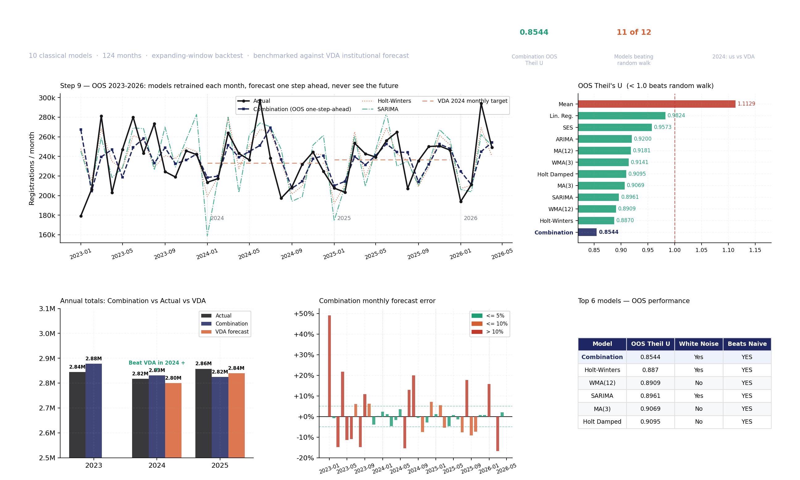
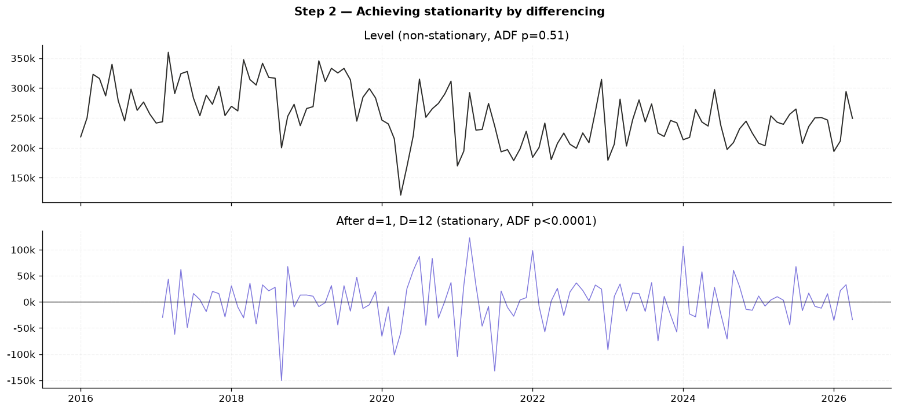

# German Passenger Car Registrations — Forecasting vs VDA

**Can a purely statistical model, trained only on public registration data, keep up with Germany's institutional automotive forecaster?**

We built a pipeline to find out.



---

## The Short Answer

Our combination model achieved an out-of-sample Theil's U of **0.8544** — 14.6% more accurate than a naive random-walk benchmark — across 76 genuine expanding-window forecasts. In 2024, it outperformed the VDA's published annual forecast (**+0.42% error** vs VDA's **−0.62%**) using nothing but historical registration data and classical statistical methods. No proprietary order-book data, no industry intelligence, no ML black boxes.

2025 was VDA's year. One-one overall — which, against an organisation with full access to every OEM's production pipeline, we will take.

---

## What We Built

A 9-step Python forecasting pipeline that:

1. Loads and explores 124 months of German passenger car registrations (Jan 2016 – Apr 2026)
2. Tests stationarity via ADF — identifies that both regular and seasonal differencing are required
3. Fits 10 classical models — from naive baselines through to SARIMA and a forecast combination
4. Validates residuals — Ljung-Box white-noise test, Shapiro-Wilk normality, scatter diagnostics
5. Combines forecasts — Holt-Winters + ARIMA equal-weight (Bates & Granger 1969)
6. Forecasts forward — May 2026 through December 2027, all models vs VDA
7. Benchmarks vs VDA — the German auto industry's published annual forecast
8. Ranks all models — OOS Theil's U leaderboard across all 12 entries
9. Runs genuine OOS evaluation 2023–2026 — models retrained each month, one step ahead, never sees the future

Every chart and table saves automatically when the script runs.

---

## Results

### OOS Model Leaderboard

| Model | OOS Theil's U | Beats Naive | White Noise |
|---|---|---|---|
| **Combination** | **0.8544** | YES | Yes |
| Holt-Winters | 0.8870 | YES | Yes |
| WMA(12) | 0.8909 | YES | No |
| SARIMA | 0.8961 | YES | Yes |
| Holt Damped | 0.9095 | YES | No |
| MA(3) | 0.9069 | YES | No |
| ARIMA | 0.9200 | YES | No |
| SES | 0.9573 | YES | No |
| Lin. Reg. | 0.9824 | YES | No |
| MA(12) | 0.9181 | YES | No |
| WMA(3) | 0.9141 | YES | No |
| Mean | 1.1129 | NO | No |

11 of 12 models beat the naive random walk. SARIMA is the most statistically clean model — only one passing the white-noise residual diagnostic. Linear Regression is the interesting failure: best in-sample fit (RMSE 27,284) but 11th out-of-sample. Classic overfitting — it memorised the training data and could not generalise.

### vs VDA Annual Forecast

| Year | Actual | Combination | Combo error | VDA forecast | VDA error | Winner |
|---|---|---|---|---|---|---|
| 2024 | 2,817,331 | 2,831,535 | +0.42% | 2,800,000 | −0.62% | **Our model** |
| 2025 | 2,857,591 | 2,824,878 | −1.14% | 2,840,000 | −0.62% | VDA |
| 2026 | TBD | 2,929,124 | — | 2,900,000 | — | — |

Our 2026 projection: 2,929,124 — 1% above VDA's 2.9M target. We are slightly more bullish on the market.

---

## Key Methodological Decisions

**Full 2016–2026 series, not post-2020 only.**
Training SARIMA on post-2020 data only was tested. Theil's U jumped to 1.55 — worse than naive. The pre-COVID years carry seasonal structure the model needs. The COVID level shift is handled with a binary intervention dummy (equals 1 from April 2020 onward), entered as an exogenous regressor in ARIMA and SARIMA.

**Expanding-window backtest, not a single train/test split.**
76 origins starting December 2019. Each forecast uses only data available at that point. One-step-ahead throughout. This is how real forecasters operate.

**enforce_stationarity=True in SARIMAX.**
Without it, a single backtest origin in April 2020 produced Theil's U = 162 billion. The flag keeps MA coefficients inside the unit circle and prevents the numerical explosion that the COVID lockdown month caused in the differenced series.

---

## How the ARIMA Order Was Identified

Box-Jenkins methodology, not guesswork:

1. ADF at level: p=0.511 — non-stationary
2. ADF after d=1: p=0.0003 — trend stationary, seasonal autocorrelation remains
3. ADF after d=1, D=12: p<0.0001 — fully stationary. Both differences required.
4. ACF of stationary series: spike at lag 1 → MA(1)
5. PACF of stationary series: spike at lag 1 → AR(1)
6. AIC grid: ARIMA(1,1,1) lowest at 2968.12
7. SARIMA(0,1,1)(0,1,1)[12]: AIC 2665.32 — beats ARIMA by 303 points



---

## OOS 2023–2026


For every month from January 2023 to April 2026, the model was retrained on all data strictly before that month and asked to forecast one step ahead. The chart shows what it predicted vs what actually happened, with the VDA monthly target overlaid.

---

## How to Run

```bash
git clone https://github.com/TejasManjunath/automobile-production-forecast
cd automobile-production-forecast
pip install -r requirements.txt

# Interactive — pauses between steps
python model/all_models.py

# Straight through
python model/all_models.py --no-pause
```

All charts save to `results/plots/` and all tables to `results/tables/` automatically.

---

## Repo Structure

```
automobile-production-forecast/
├── model/
│   └── all_models.py              <- 9-step pipeline, fully commented
├── harness/
│   └── backtest_harness.py        <- shared metric functions and data loader
├── data/
│   └── german_auto_monthly_2016_2026.csv
├── results/
│   ├── plots/                     <- all charts (step1-step9 + hero)
│   └── tables/                    <- all CSVs
├── requirements.txt
└── README.md
```

---

## Stack

`Python 3.10+` · `pandas` · `numpy` · `statsmodels` · `scipy` · `matplotlib`

---

## Context

Built as part of the Simulation & Forecasting Techniques module, MSc Business Intelligence & Data Science, ISM Dortmund. The research question was genuine: can classical statistical methods compete with an institutional forecaster that has access to OEM order books, semiconductor supply data, and industry networks?

On the headline registration series: roughly yes. On the BEV sub-series — where Germany's sudden EV subsidy termination in December 2023 caused a demand collapse that no historical model could anticipate — no. Knowing why your model fails is part of doing the analysis correctly.

---

*Data: Deutsche Bundesbank monthly compilation, built from VDA and KBA figures.*
*Benchmark: VDA published annual forecasts 2024 and 2025.*
